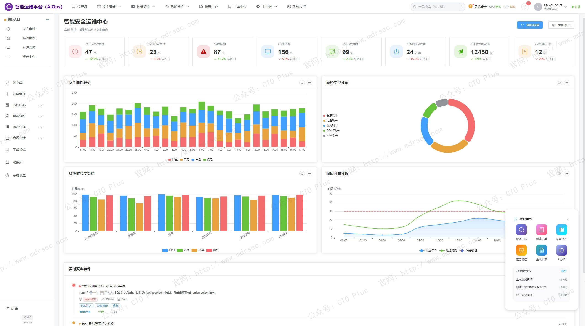
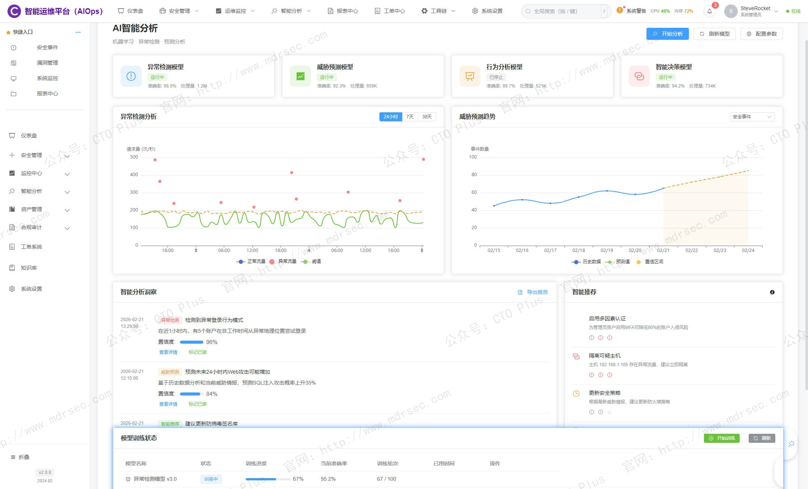
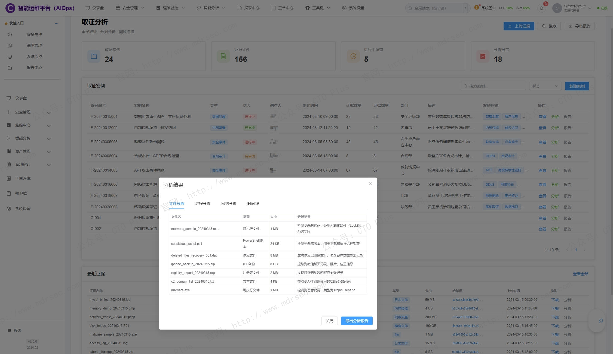
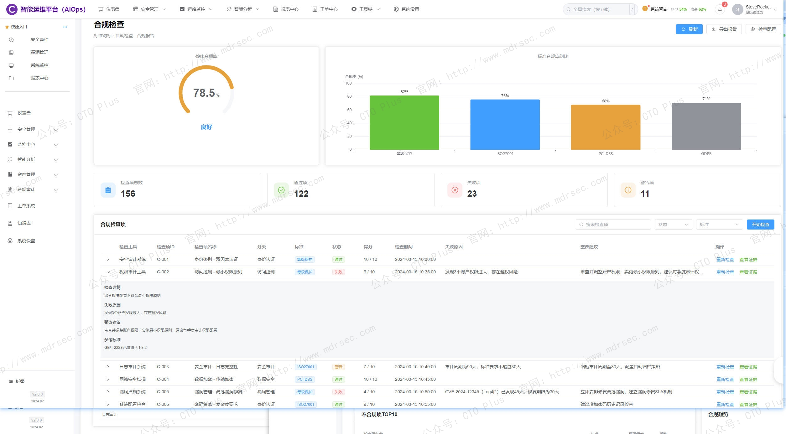
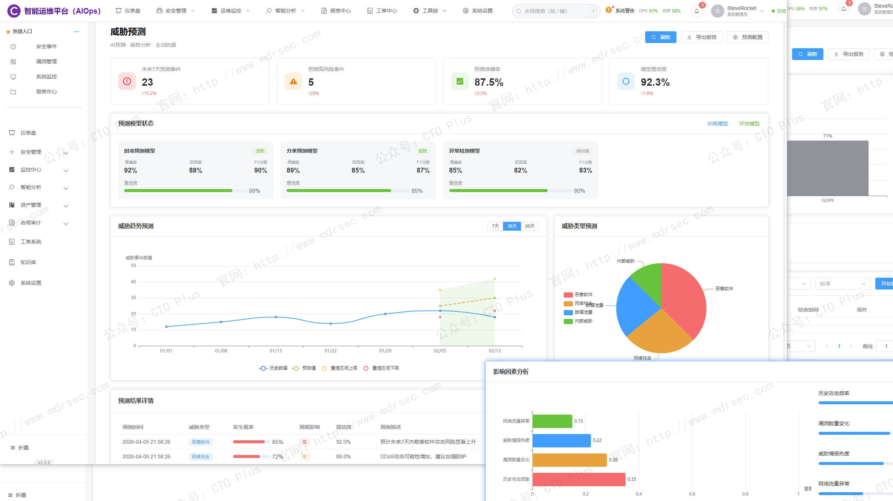
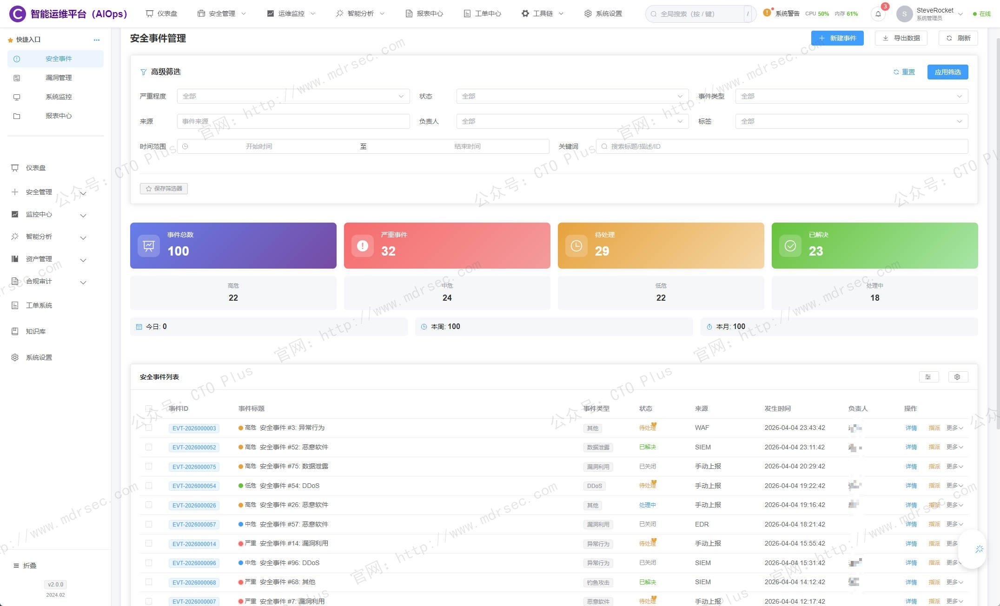
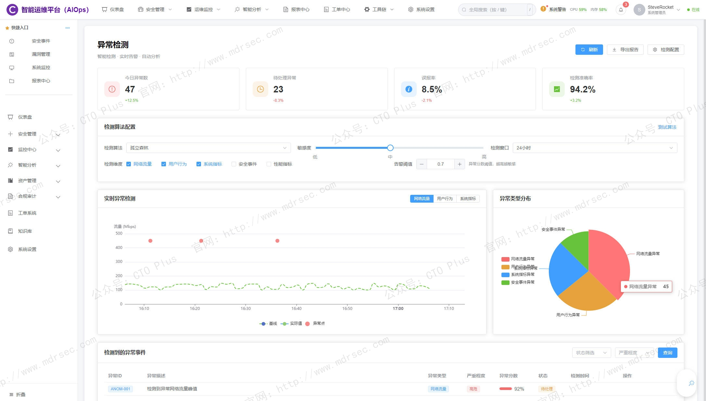
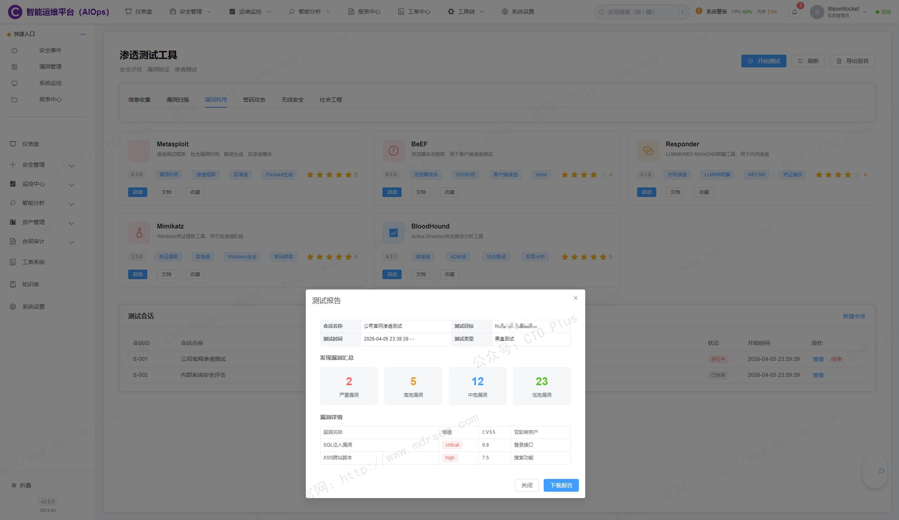
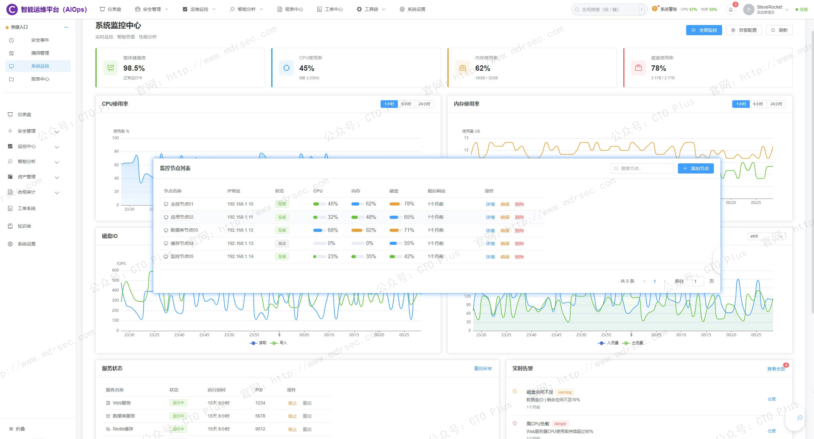

# 智能运维平台（AIOps）

## 关于我们

- 官网： http://www.mdrsec.com

我们的技术文章和产品概述欢迎浏览我们的门户。

- 公众号：CTO Plus

最新的动态欢迎关注我们官方唯一公众号。

- 作者QQ

更详细更具体的需求，或者项目合作，或者问题 欢迎联系我。

- QQ群

我们官方组建的QQ群，如果您有兴趣也可以加入我们。

- 请喝咖啡

如果感兴趣，也可以请我喝杯咖啡

## 产品核心功能模块

我们AIOps（人工智能运维）平台并非单一功能的工具，而是将人工智能与机器学习深度融入IT运维全流程的综合性平台。核心目标是解决现代云原生和混合IT环境中数据爆炸、告警淹没、依赖复杂以及故障排查缓慢等痛点。

这里先介绍下我们自研的AIOps平台功能特性

### 全域可观测性与统一数据

我们AIOps首先是一个强大的数据融合与观测平台，而非孤立的监控工具。

*   **多源数据统一接入**：能够通过Agent、API、SDK等多种方式，从各类数据源采集数据，包括：
    *   **指标**：CPU使用率、内存、延迟、吞吐量等时序数据。
    *   **日志**：应用程序、系统、安全设备等打印的各类文本日志。
    *   **追踪**：分布式追踪数据，完整记录一个请求在微服务间的完整路径。
    *   **事件**：告警、工单、变更通知、配置更新等。
*   **自动化服务拓扑发现与依赖映射**：能自动发现IT环境中的所有组件（应用、数据库、消息队列、容器、虚拟机等），并动态构建它们之间的依赖关系图，形成“数字孪生”或服务地图。这对于理解故障传播范围和影响分析至关重要。
*   **端到端的全栈可观测**：从最终用户体验（如网页加载、App响应），到应用代码性能（APM），再到基础架构（服务器、网络、存储），实现贯穿整个技术栈的可见性。同时，提供Pod、节点、Ingress、内存等在内的全方位诊断。

### 智能信号处理与告警治理

在拥有数据的基础上，我们的AIOps运用AI算法对海量信号进行降噪和提炼，解决“告警风暴”问题。

*   **动态基线异常检测**：摒弃静态阈值，利用机器学习算法（如时序预测、孤立森林等）为每个指标（如每秒请求数）建立动态变化的“正常行为基线”。任何偏离基线的行为都被视为潜在异常，能更早、更准地发现细微的、非线性的问题。
*   **告警收敛与事件关联**：将短时间内发生的大量、冗余、重复的告警进行智能压缩和去重。更重要的是，它能将源自同一根本原因的相关告警关联在一起，形成一个需要处理的“事件”或“工单”。这是我们AIOps的核心基础功能。
*   **告警风暴抑制**：通过上述关联和收敛，运维人员收到的不再是成百上千条杂乱无章的告警，而是几个高度凝练、包含完整上下文的关键事件。

### 深度分析与根因定位

这里我们不仅仅告诉你“系统出问题了”，而是告诉你“哪里出问题了”以及“为什么”。

*   **自动化根因分析**：这是AIOps的“圣杯”功能。当检测到异常后，AI引擎会结合拓扑依赖、变更记录、日志模式和指标关联性，自动进行因果分析，快速定位故障源头。例如，AWS CloudWatch AIOps可以自动分析是某个配置变更、数据库慢查询还是特定Pod的内存泄漏导致了整体性能下降。
*   **日志模式智能分析**：利用NLP（自然语言处理）技术自动分析和聚类海量日志，发现异常日志模式，并将其与性能指标关联起来，提供更丰富的诊断证据。
*   **变更影响分析**：自动关联配置变更、发布记录等，快速判断最近的变更是否为导致当前问题的诱因，这是根因分析的关键环节。

### 自动化执行与闭环修复

发现并定位问题后，我们AIOps的目标是实现快速甚至自动化的修复。

*   **确定性任务自动化**：对于流程清晰、规则明确的常规任务，通过预定义的“Runbook”（运维手册）实现自动化执行，如服务重启、账号创建、证书轮换等。
*   **智能运维编排与自愈**：将异常检测、根因分析、修复操作和结果验证串联成一个闭环。
    1.  **检测**：发现磁盘使用率超过动态基线。
    2.  **诊断**：定位到是某个日志目录异常增长。
    3.  **修复**：自动触发一个预定义作业，清理过期日志文件。
    4.  **验证**：确认磁盘使用率恢复正常。
    该功能是实现“无人值守运维”的关键。
*   **集成与联动**：同时，我们AIOps平台提供了开放的API和丰富的插件，能与现有的工单系统、即时通讯工具（如钉钉、Slack）、自动化工具（如Ansible）和容器编排平台（如Kubernetes）无缝集成，实现复杂流程的编排。例如，可以在创建工单的同时，在IM群里创建一个故障分析群，并将相关信息推送给负责人。

### 预测分析与主动预防

将运维模式从“被动救火”转向“主动防火”，这是我们AIOps带来的重要一个特性。

*   **容量预测与智能推荐**：通过分析资源的历史使用趋势，预测未来何时会出现资源瓶颈（如CPU、内存、磁盘），并给出扩容或缩容的“右规模”建议，优化云成本。
*   **故障预测**：基于对关键指标（如硬盘SMART信息、应用错误率趋势）的持续分析，预测潜在故障（如硬盘即将损坏、服务即将过载）的发生时间和概率，并提前发出预警，以便运维团队在业务受影响前进行干预。
*   **风险巡检与健康度评估**：定期对系统进行全面扫描，如同“体检”一般，发现潜在的配置风险、版本漏洞、性能瓶颈和架构隐患，并生成可视化的健康度报告和修复建议。例如，华为云社区分享的AIOps实践，将预测作为整个闭环的起点。

### 最后

接下来，我们AIOps平台后续将重点围绕以下两个方向扩展：

1.  **生成式AI集成**：通过对话式界面，让运维人员用自然语言提问（如“昨晚三点发生了什么？”，或者“帮我查一下订单服务的错误日志”），AI能直接提供分析结果、生成故障报告，并提出修复建议，极大降低运维门槛。
2.  **安全运维融合**：IT运维（AIOps）与安全运维（SecOps）正在逐步融合。一个平台同时分析性能数据和威胁情报，帮助团队从安全事件和性能故障两个维度统一保障系统韧性。

一个完整的AIOps平台，其价值并非一蹴而就。对于大多数企业而言，理想路径是先夯实**可观测性基础**，再逐步落地**告警治理**和**根因分析**，最终向**预测和自动化闭环**演进，逐步从“人肉运维”走向“自动驾驶式运维”。

更多功能模块和演示系统环境，如有需求和问题欢迎联系咨询我们。 http://www.mdrsec.com

## 产品清单

### 企业网络安全运营中心产品

- 资产安全配置管理系统（SCMDB）
- 终端侦测与响应系统（EDR）
- 网络侦测与响应系统（NDR）
- 企业网络资产攻击面管理系统（CAASM）
- 资产暴露面管理系统（AEMS）
- 网络安全蜜罐管理系统（HoneyPot）
- 安全事件收集与告警管理系统（SIEM）
- 扩展侦测与响应系统（XDR）
- 多引擎脆弱性扫描系统（VAS）
- 多源日志审计监测系统（LAS）
- 网络安全威胁情报中心（TIS）
- 网络安全漏洞库管理系统（VDBS）
- 网络安全编排与自动化响应（SOAR）
- 威胁狩猎系统（THS）
- 数据库安全审计系统（DSAS）
- AI智能体安全态势管理系统（AISPM）
- Web防火墙（WAF）
- 网站安全监测平台（WSM）
- 网络安全态势感知平台（SSAP）
- 网络安全自动化应急响应工具系统（NSRT）
- 企业网络安全运维工具系统（SecTools）
- 网络安全自动化等保测评系统（ASES）
- 浏览器安全监测防护系统（BSMPS）
- 网络安全用户实体行为分析系统（UEBA）
- 互联网电信诈骗预警防护系统（TPFWS）
- 云原生安全管理平台（CNAPP）
- 自动化渗透测试系统（PTS）
- 工业企业信息安全监测中心（IoT SOC）
- 企业智能安全运营中心（AISOC）

### 企业自动化运维产品

- 运维智能监控告警管理平台（AIMAMS）
- 企业网络工具系统（NTools）
- 自动化测试系统（AutoTest）
- 自动化运维系统（AutoOps）
- 企业运维工具系统（OpsTools）
- 物联网管理系统（IoTS）
- 软件开发生命周期管理系统（SDLC）
- IT流程管理系统（ITSM）

### 企业数字化运营资源管理系统产品

- 制造执行管理系统（MES）
- 运输管理系统（TMS）
- 跨境电商企业资源管理系统（ERP）
- 企业客户关系管理系统（CRM）
- 跨境电商仓库管理系统（WMS）
- 财务管理系统（FMS）
- 质量管理系统（QMS）
- 精准营销管理系统（PMS）
- 智能生产管理系统（SPMS）
- 电商BI系统（BI）
- 智能互联网分布式爬虫系统（AISpider）
